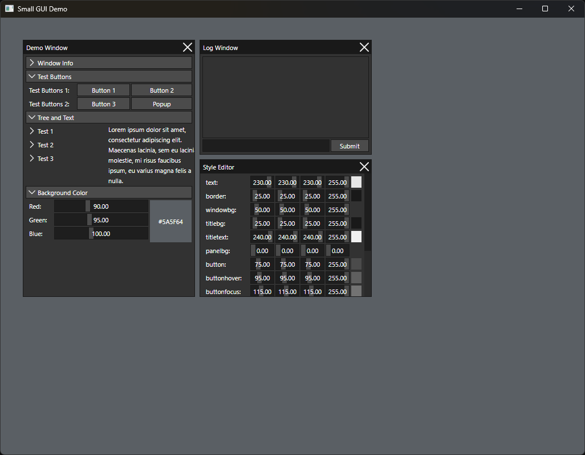

# abremir.SmallGui

small gui (microui + fenster), but in C# + Avalonia UI

## Motivation

[tekknolagi/full-beans](https://github.com/tekknolagi/full-beans) is a no-fluff way to just "put pixels on a screen" in C. No need to know anything, or to worry, about any of the underlying tech to achieve it. It is a lightweight, immediate-mode UI system, and binds:

- [microui](https://github.com/rxi/microui): A tiny, C99 immediate-mode UI library with layouts, text rendering, and simple interactive widgets.
- [fenster](https://github.com/zserge/fenster): An ultra-minimal, cross-platform canvas library.

With this as a starting point, I decided to build something similar but in C# and using Avalonia UI.

## Implementation

The initial step was to ask an AI agent to analyze `microui.h` and `microui.c` and provide an implementation in C#. With a few tweaks the [abremir.MicroUISharp](./source/abremir.MicroUISharp/) library was created and provides an equivalent API surface area.

Wanting a C# cross-platform canvas I opted to use Avalonia UI, writing a 100% code-first immediate-mode engine that treats an Avalonia control as a blank canvas (the `fenster` component) and renders custom, stateful widgets directly onto it using an immediate coordinate layout queue (the `microui` component).

### [MuContext.cs](./source/abremir.MicroUISharp/MuContext.cs)

This replicates `microui` handling layout columns, mouse collisions, checkbox/slider state mutation, and immediate drawing calls.

Special care had to be taken in regards to how widget IDs were calculated as `microui`, being in C, in some cases uses pointer references to the values of the widgets.

In C#, even though possible to achieve a similar outcome by using pointer inside `unsafe` blocks, I decided to use a different method: IDs for those widgets are calculated by using the variable name captured with the addition of `[CallerArgumentExpression(nameof(buf))] string expression = ""` to the method signatures.

For these cases the variable with the value is also declared as `ref`, and this means that these variables will need to be declared outside of the `context` callback in the `SmallGui.Run()` method.

### [MicroUiControl.cs](./source/abremir.SmallGui/MicroUiControl.cs)

This acts as the `fenster` layer, handling pointer and keyboard updates, mouse state, and forcing redrawing cascades. This is where the code-first UI state logic sits.

### [SmallGui.cs](./source/abremir.SmallGui/SmallGui.cs)

The bootstrap configurations to execute everything without XAML markup compiling files.

### [Program.cs](./source/abremir.SmallGui.Demo/Program.cs)

Demo application similar to the one provided in [microui](https://github.com/rxi/microui/blob/master/demo/main.c).

## Acknowledgements

- [tekknolagi/full-beans](https://github.com/tekknolagi/full-beans)
- [microui](https://github.com/rxi/microui)
- [fenster](https://github.com/zserge/fenster)
- [Fluent UI System Icons](https://github.com/microsoft/fluentui-system-icons)